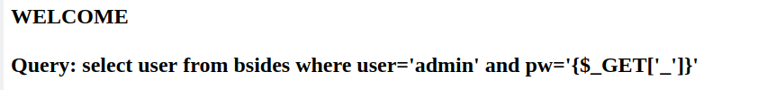

# WRITEUP Seek You EI (Blind-SQLi)

## __Author:__ p4w @ beerpwn team


<br>
First thing I had to do was to bypass the firwall that blocks the usage of `_` character. As we noticed from the image above, this character is used by a vulnerable query as GET parameter name. The first trick is based on a bahavior of php that automatically converts the `.` into `_`, so we can use this behavior to bypass the restriction.
The GET parameter is vulnerable to SQL-injection. The main problem here is that the output don't change in any way if the query match for something or not.
The first idea that I had is to leak the database using time-based technique, but unfortunately the firewall block us. I start to enumerate the firewall rules and comes out that `sleep` and `bench` words were blacklisted, then no time delay for us. Also other words match the firewall rules eg `like`,`if` etc...
After a bit of try and errors I noticed that if the query has some syntax error, the server replies with a blank response that is different from the normal one. Then __server error__ means __blank response__.
So the idea that I had was:
what if I control this behavior with a query in order to trigger a boolean condition to extract information?
The question that I had to answer now was "how can I force a server error with a query?". Well, after some time my brain comes out with an answer: using some "heavy" operation number to cause a MySQL server side error!
To do that the `pow()` function seems to be a good candidate. Behaving that the flow was correct I builded a payload to prove that.
```(SQL)
asd' OR pow(99999999, pow(99999999, pw regexp '^')) --
```
This payload will produce an error when the regex match because the regexp return 1, then the dbms has to calc `99999999^(99999999^1)` and this result should be too big; instead when the regexp fail the match then it return 0 so the dbms calc should be `99999999^(99999999^0) = 99999999^1`.
Regex match generate blank resp:

<br>
Regex NOT match generate resp with contents:

<br>
As you can see from the image above the techinique works like a charm so we have the control over the server error and we can build our blind exploit from this behavior.
<a href="./sqli_exploit.py">Here</a> you can find the full exploit that I written during the CTF.
And here you can see the output of the script extracting the admin pwd:


Oh and obviously flag time ;


Cheers, p4w!
