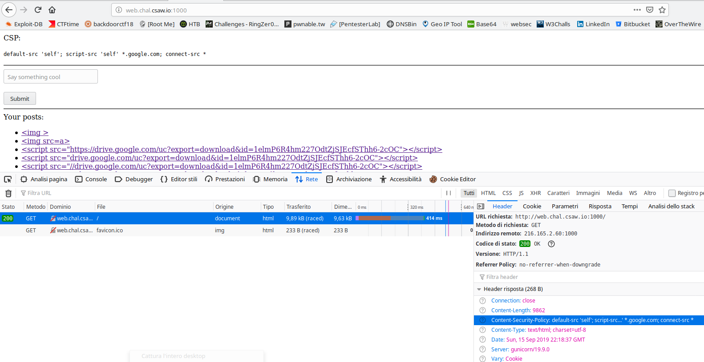

# WRITEUP BABYCSP

## Author: p4w @beerpwn team


As the descrption/title say we will probably need to bypass CSP to trigger some XSS.
Sufing to the index page we have this:


## Understanding the CSP
The directive ``````
So the CSP permit to use the script that are coming from *google.com
