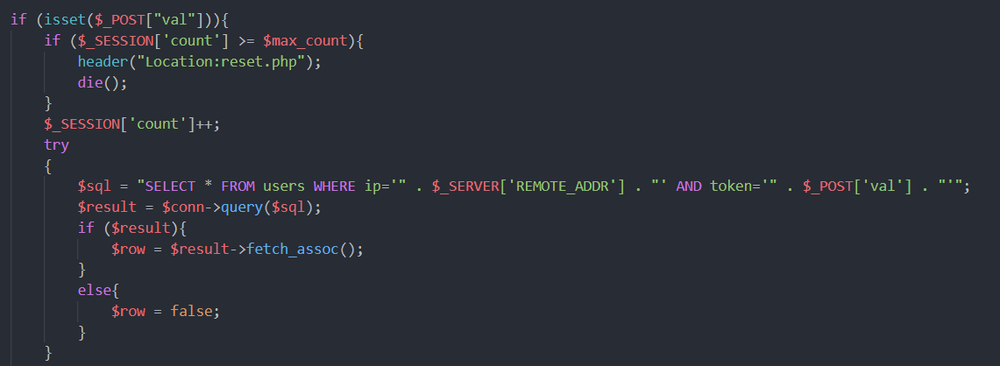
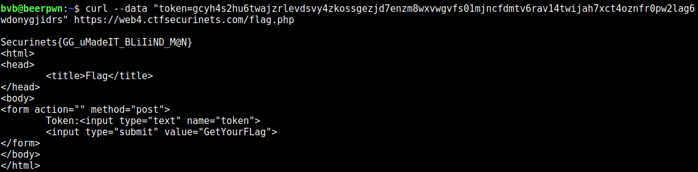

# Beginner's Luck Writeup

## __Author:__ bytevsbyte @ beerpwn team

This was a web challenge, and we had the source files of some php pages.
All begin with a request to index.php and then we are redirected to
the play.php page where we can see a token and a string that tells us
that we are not lucky and we must retry.\
The index.php just generate a new token for a client, and insert it in
a new row (IP, TOKEN) into users database table.
So, each IP has its token associated.
There is also a counter and after ten tries we must start again.\
Now it's time of next file, play.php.
Maybe here there is.. ohhh a SQL injection :)



The val POST variable is used in the query string as it is, BAD! (or good for us)\
There isn't a direct output, so we had to go blind.
But, we have a positive text in the server response
if we sent a right token (_True_) and negative otherwise
(_Better luck next time !_).
This is a beautiful thing.\
I tested the SQL injection with:

```sql
' OR token LIKE '%' --  
```

and I obtained _`True`_, so it works.\
From now on I use a match with substring because I want an exact match.
With _`substring(token,1,index)=part_of_token`_ or
_`substring(token,index,index)=character`_ we can steal it incrementally
(the part of string or character is correct if the server answer with _True_).

But now there is a big __problem__, the limited number of requests we have
before the token must be renewed.

So, after ten tries we have to restart and the token is regenerated,
and all our efforts are gone!\
But, we have complete control of the query,
and we can add to the injection the matching
a different IP, so we can steal the token of someone else.\
The SQL injection became something like:

```sql
' OR ip='x.x.x.x' AND substring(token,1,index)=xxxx --  
```

I used the beerpwn server to make the first request to the challenge with curl.
After the creation of the row in the db I use my pc at home
to steal the token of the server. \
The limitation of ten requests remains but now it's not a problem because,
the token renewed is of the pc at home not the server and after the
request index.php I can continue with other 10 requests, and so on.\
You can find the script in python that I created [HERE](./exploit.py).

At the end, I submitted the flag from the server,
due to the check on the IP.


