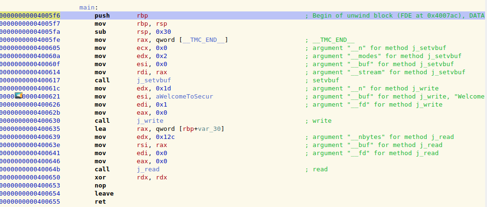
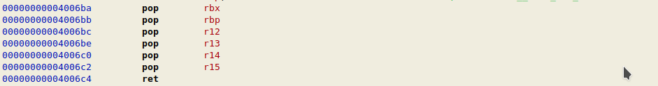
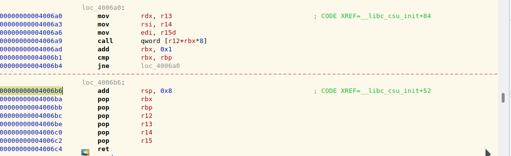

### writeup by p4w@beerPWN team

# Securinets 2019 CTF
## baby_1 PWN challnge


We have a 64-bit binary and the libc of the remote server.
Quickly we can notice that there is a stack buffer overflow in the main() function that read from stdin.
The main problem of this pwn challenge was that the register rdx will be xored with himself at the end of the main() function as you can see from the disassembly.



Then the register will contain 0x0 when we actually get the control over rip register.
We need to leak some address, and we want to do that by using the write() function, but we need some gadgets to set the registers rdi, rsi, and rdx.
This because the write function expect 3 params (in 64-bit mode the arguments are passed via registers).
For the first 2 params we have two good and easy gadgets that allow us to set rdi and rsi registers.

```0x00000000004006c3 # pop rdi ; ret```
```0x00000000004006c1 # pop rsi ; pop r15 ; ret```

For the rdx register... well we need to use some more creative gadgets:




With this in mind we can buld the exploit that:
1) leak address from GOT
2) restart execution
3) evaluate libc_offset
4) own the executable by smash the stack and ret2libc on system()

you can check the full <a href="./exploit.py">exploit</a> here.