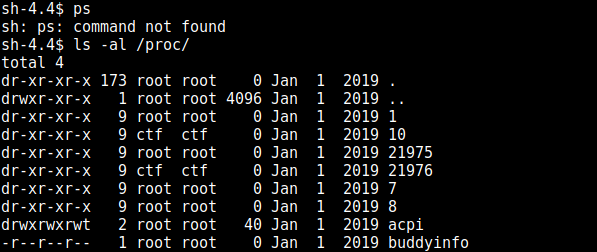
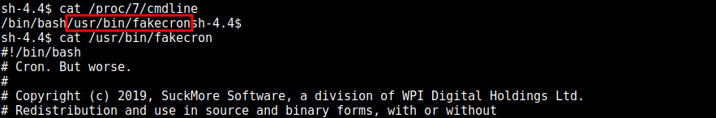
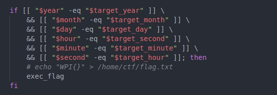
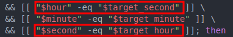
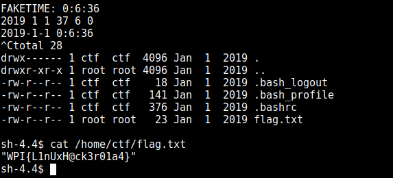

# Crond Writeup (Linux challenge)

## __Author:__ bytevsbyte @ beerpwn team

The challenge provides ssh access as __ctf__ user.\
At the first glance, it seems there are no interesting files on the machine.
In `/home/ctf/` as in other path there is no trace of flag.\
The name of the challenge refers to cron so I search for all possible cron file
and check my cron with _crontab_, but this command doesn't exist.\
With find, and _"\*cron\*"_ as search string, I get the __/usr/bin/fakecronsh__ file,
interesting!\
Before examining the file, I want to enumerate a little more.\
In case of repetitive tasks, looking at what processes are spawned in a time range
can reveal a lot of things.\
I could run __ps__ so I can look for something useful.. and ps was not found :'(\
Ok, I can see processes the same way with `ls -al /proc/`:



There are some processes owned by root. In the figure the process with pid 21975
dead and spawn with new PID continuously. But the 7 and 8 are always alive.
With `cat /proc/7/cmdline` can be retrieved the original command:



The same fakecron that I found with _find_ command.
This is the right way!\
Look at the script to figure out what it does.

[Script](./fakecron.sh)

So, there's a `/etc/deadline` file and the values _target\_second_, _target\_minute_..
are loaded each loop iteration from this. Note that I have write permission on this file.\
The _second_, _minute_, _hour_.. are initialized with hardcoded integers in the script
and are incremented at each iteration.\
The flag part here resides in the _if_ statement.
There's a commented line with _echo_ of possible flag into `/home/ctf/flag.txt`.\
Below this there is the __exec_flag__ command, that I hope it does the same thing.



All variables must be equal to their relative _target\_xxx_ to satisfy the condition.
I need those numbers!!!\
Fortunatelly they are written in the `/etc/faketimerc` with different format.\
Ok.. I can read the current (one second before) values from __faketimerc__ and put them,
in the correct format, into the __deadline__ file.\
At the end I could check if there is a flag file in the home dir.
Note the second value that is +1:

```(bash)
while [ 1 -eq 1 ]; do
    faket=`cut -d ' ' -f2 /etc/faketimerc`
    h=`echo $faket | cut -d ':' -f1`;
    m=`echo $faket | cut -d ':' -f2`;
    s=`echo $faket | cut -d ':' -f3`;
    echo "FAKETIME: $faket";
    echo "2019 1 1 $h $m $((s+1))" | tee /etc/deadline
    cat /etc/faketimerc;
    ls -al /home/ctf
done
```

Perfect, all done, all ready!\
Launch it and ... It doesn't work. No flag.txt was created. Good!\
I tried to find the mistake paying more attention to the if in _fakecron_:



Ohhh, son of a ... hour and seconds in fakecron are inverted!\
This is the one line version of my previous script __fixed__:

```(sh)
while [ 1 -eq 1 ]; do faket=`cut -d ' ' -f2 /etc/faketimerc`; h=`echo $faket | cut -d ':' -f1`; m=`echo $faket | cut -d ':' -f2`; s=`echo $faket | cut -d ':' -f3`; echo "FAKETIME: $faket"; echo "2019 1 1 $((s+1)) $m $h" | tee /etc/deadline; cat /etc/faketimerc; ls -al /home/ctf; done
```

And finally I have the flag!

