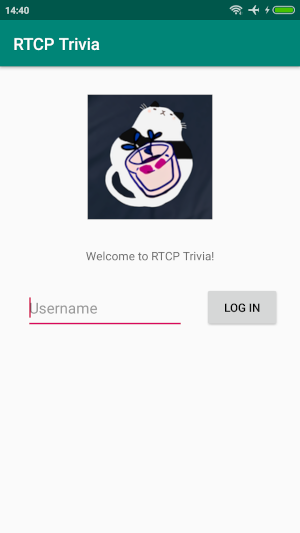
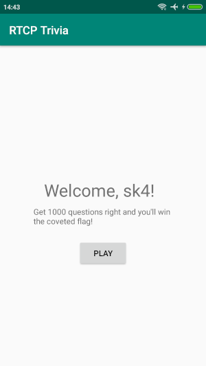

#### Writeup by <a href="https://twitter.com/sk4pwn">@sk4</a>

### RTCP TRIVIA
This week I've partecipate to Houseplant CTF.
This blogpost is related to a nice Android reverse engineering challenge: RTCP TRIVIA.

The challenge description was: "We now have our very own trivia app! Solve 1000 questions and win a flag!". Ok, try to do it 😉.

#### Decompile the apk
The first step, after download the client.apk, was try to decompile it. I've used the utility ```apkx```, that you can find in his <a href="https://github.com/b-mueller/apkx">official repository</a>, that permit you to obtain the java code of the apk.
```
$ apkx client.apk
Extracting client.apk to client
Converting: classes.dex -> classes.jar (dex2jar)
dex2jar client/classes.dex -> client/classes.jar
Detail Error Information in File ./classes-error.zip
Please report this file to http://code.google.com/p/dex2jar/issues/entry if possible.
Decompiling to client/src (cfr)
```
The code of the application it's saved on ```client``` directory. Inspecting the code, it was possible to see some relevant classes inside ```client/wtf/riceteacatpanda/quiz``` directory:

* MainActivity.java
* LoggedIn.java
* Game.java
* Flag.java

In MainActivity.java class, there were some interesting lines that suggest such communication with a server using the websockets, like this line:
```
...
string = object2.a("Sec-WebSocket-Accept");
...
```
The next step, then, was run the application in an emulator or an Android device, setting up a proxy for check eventuals websocket communications.

#### Running and proxy
The main activity was a form login with an input text for the username and a login button:



I have tried to insert an username and press the login button and a websocket request was sent to a server, how I've seen in my BurpSuite proxy:


After the login there was the LoggedIn activity with only a *play* button:



Pressing the button, a websocket request happened with a reply by the server:


In the response, there was the first question that I had to answer correctly, but it was all encrypted, then I had to reverse the code of the apk for see how the answer was encrypted and decrypted.

#### Get the encryption keys
Looking at the code of the Game activity, I've seen that some lines are used to create a new `cipher` object:

```
...
jSONObject = new JSONObject(this.d);
cipher = new nx(Game.this.getIntent().getStringExtra("id"), Game.this.getResources()).a();
object = jSONObject.getString("id");
object2 = new StringBuilder();
object2.append((String)cipher);
object2.append(":");
object2.append((String)object);
object = nx.a(object2.toString());
cipher = nx.b(jSONObject.getString("requestIdentifier"));
object = new byte[]((byte[])object, "AES");
object2 = new IvParameterSpec((byte[])cipher);
cipher = Cipher.getInstance((String)"AES/CBC/PKCS7Padding");
cipher.init(2, (Key)object, (AlgorithmParameterSpec)object2);
object = cipher.doFinal(Base64.decode((String)jSONObject.getString("questionText"), (int)0));
...
```

The line with the following code: `cipher = Cipher.getInstance((String)"AES/CBC/PKCS7Padding");` suggested an AES cipher, then the next step was search what *key* and *iv* was used for the encryption.\
The *iv* was initialized with the following code: `object2 = new IvParameterSpec((byte[])cipher);` where the cipher variable was created with `cipher = nx.b(jSONObject.getString("requestIdentifier"));`, then I had to going into the `nx` class to see what `b` function does. This class was in the `client/nx.java` file, and the implementation of `b` function was:

```
public static byte[] b(String string) {
    int n2 = string.length();
    byte[] arrby = new byte[n2 / 2];
    for (int i2 = 0; i2 < n2; i2 += 2) {
        arrby[i2 / 2] = (byte)((Character.digit((char)string.charAt(i2), (int)16) << 4) + Character.digit((char)string.charAt(i2 + 1), (int)16));
    }
    return arrby;
}
```

Reverse this function was complex, then I've created a *frida* script for hooking at runtime the `b` function and see his input and output😆:

```
Java.perform(function () {
    var nx = Java.use('nx');
    nx.b.implementation = function(x) {
      console.log(x);
      var tmp = this.b.call(this, x);
      console.log(JSON.stringify(tmp));
      return tmp;
    }
});
```

Then I've started the frida server on my Android device:

```
adb shell
santoni:/ $ su
santoni:/ # cd data/local/tmp
santoni:/data/local/tmp # ./frida-server-12.8.20
```

and run my *frida* script with the following command:
```
$ frida -U -f wtf.riceteacatpanda.quiz -l frida-script.js --no-pause
     ____
    / _  |   Frida 12.8.20 - A world-class dynamic instrumentation toolkit
   | (_| |
    > _  |   Commands:
   /_/ |_|       help      -> Displays the help system
   . . . .       object?   -> Display information about 'object'
   . . . .       exit/quit -> Exit
   . . . .
   . . . .   More info at https://www.frida.re/docs/home/
Spawned `wtf.riceteacatpanda.quiz`. Resuming main thread!
[Redmi 4X::wtf.riceteacatpanda.quiz]-> 435db0475dae503ff9f8f2e829bc1eff
[67,93,-80,71,93,-82,80,63,-7,-8,-14,-24,41,-68,30,-1]
[Redmi 4X::wtf.riceteacatpanda.quiz]->
[Redmi 4X::wtf.riceteacatpanda.quiz]->
```

The results was printed after that the *play* button was pressed. The value `435db0475dae503ff9f8f2e829bc1eff` was the input of the `b` function and `[67,93,-80,71,93,-82,80,63,-7,-8,-14,-24,41,-68,30,-1]` was the output; this array was simple a byte array of the md5, and the hash was the value `requestIdentifier` of the websocket response how it was possible see on BurpSuite:

```
{"method":"question","id":"f2415db1-2e1e-4fcb-ab53-6888f827ff53","questionText":"4ZApGDm/AtyrLRr4nqXIEJglPQLbyDGUqLIHSYCSpLQB3tJwKjoSwbyhN/X5hw7x","options":["rk2Afy/3s5gU1pkkrhbvKTvyczZzMGvqNbftHMouZm+e5LsCw5dCHFwbUoAH26X8","OSXlcam6H/rRDhVDm1xz/yisctXTyUcXj2u77i+Lm8ls+0/D19ZdkHQWEB+CbQty","OSXlcam6H/rRDhVDm1xz/5Ktp6gID+qOzuZssCjmM5awEzqMhRBgK1n9AnvVhH/m","AxdN6riR1F8JUHKjovkeXeAvBJZSBUHBGWDLErPZXiWPEcVAymRtgDavF6qo/F01"],"correctAnswer":"TEUIG77TMZfiVjr7Jo6pasRXb+HvF5iZrRASO/qknY4=","requestIdentifier":"435db0475dae503ff9f8f2e829bc1eff"}
```

After obtaining the *iv* of the AES cipher, I've tried to get the key. Returning in the Game activity, I've looked to this line:

```
...
cipher.init(2, (Key)object, (AlgorithmParameterSpec)object2);
...
```

The second parameter was an object *Key*, that was the passkey of the cipher, and it was initialized in the following line in the same class:

```
object = new byte[]((byte[])object, "AES");
```

Where `object` was created by the following snippet of code:

```
...
cipher = new nx(Game.this.getIntent().getStringExtra("id"), Game.this.getResources()).a();
object = jSONObject.getString("id");
object2 = new StringBuilder();
object2.append((String)cipher);
object2.append(":");
object2.append((String)object);
object = nx.a(object2.toString());
...
```

Essentially, it was the output of `a` function of the `nx` class and his input was a string construction. Below there is the code of `a` function:

```
public static byte[] a(String string) {
    return MessageDigest.getInstance((String)"SHA-256").digest(string.getBytes());
}
```

It seemed to create a sha256 hash and return it's bytes. For confirm this, I've added the following code to my *frida* script to print the input and the output:
```
nx.a.overload('java.lang.String').implementation = function(x) {
  console.log(x);
  var tmp = this.a.call(this, x);
  console.log(JSON.stringify(tmp));
  return tmp;
}
```

Running the script I've obtained the following result:

```
$ frida -U -f wtf.riceteacatpanda.quiz -l frida-script.js --no-pause
     ____
    / _  |   Frida 12.8.20 - A world-class dynamic instrumentation toolkit
   | (_| |
    > _  |   Commands:
   /_/ |_|       help      -> Displays the help system
   . . . .       object?   -> Display information about 'object'
   . . . .       exit/quit -> Exit
   . . . .
   . . . .   More info at https://www.frida.re/docs/home/
Spawned `wtf.riceteacatpanda.quiz`. Resuming main thread!
[Redmi 4X::wtf.riceteacatpanda.quiz]-> 09dc959d4d2339ae51907054693c9498bae57f442a4cce3cddb1c65c73cac9f8:d114f803-db55-4c61-902b-c37c5a74bfb4
[-24,-21,-126,46,-99,0,55,31,-117,124,48,52,66,-35,-32,52,52,-68,8,-114,-66,2,-109,-123,66,32,-78,69,-60,81,-105,56]
```

where in the input of `a` function there was the following string:

```
09dc959d4d2339ae51907054693c9498bae57f442a4cce3cddb1c65c73cac9f8:d114f803-db55-4c61-902b-c37c5a74bfb4
```

that was a contatenation of two string: a sha256 hash and an id value. The id value was obtained from the response, in the websocket, exactly as *requestIdentifier* for the *iv*:

```
{"method":"question","id":"d114f803-db55-4c61-902b-c37c5a74bfb4","questionText":"+hMOiUytB3RJ8t+DaPmmW6zjEy4CrMBkBYGFZYHgPJTyyb5y+VwWcv96JF002Kw9","options":["Evp2HJgs4kGAURS7X38kbw==","vbLeZJD/gktdTAC3Y5S6vQ==","byeVrqWz12iTan7TGdgDgQ==","VmBnGyexeSDjeXSX/BdntA=="],"correctAnswer":"LA1hBsCFklUfCE+gD97puvwiVed9PVTNrB4Vbu7JEBk=","requestIdentifier":"4aab40789c16c59880d1c9ff581be531"}
```

but the sha256 hash? It seemed to be computed by `nx` class from another implementation of `a` function, below reported:

```
public final String a() {
    int n2;
    byte[] arrby = this.a.openRawResource(2131427328);
    StringBuffer stringBuffer = new byte[arrby.available()];
    Object object = new byte[arrby.available()];
    arrby.read((byte[])stringBuffer);
    arrby.close();
    new ArrayList();
    int n3 = 0;
    for (n2 = 0; n2 < stringBuffer.length; ++n2) {
        double d2 = n2;
        if (Math.sqrt((double)d2) % 1.0 != 0.0) continue;
        object[(int)Math.sqrt((double)d2)] = (Object)stringBuffer[n2];
    }
    arrby = MessageDigest.getInstance((String)"SHA-256").digest((byte[])object);
    stringBuffer = new StringBuffer();
    for (n2 = n3; n2 < arrby.length; ++n2) {
        object = Integer.toHexString((int)(255 & arrby[n2]));
        if (object.length() == 1) {
            stringBuffer.append('0');
        }
        stringBuffer.append((String)object);
    }
    return this.c(String.valueOf((Object)stringBuffer));
}
```

after some investigation, I've found that the value returned by this method was computed from the hash that the app initially communicates to the server (inside the *userToken* value provided in the first websocket request), in this way both, client and server, can compute the hash used for the encryption key.

Summarizing:
* the *key* was a sha256 computed by a concatenation of two string: a sha256 value computed using *userToken* providing during the login, and the id provided by the server.
* the *iv* was a value returned by the server in *requestIdentifier*.

After obtaining the keys used for decrypt the response, I was able to create a script to respond correctly at 1000 question😆.

#### Final exploit
```
from websocket import create_connection
from Crypto.Cipher import AES
from pkcs7 import PKCS7Encoder
from hashlib import sha256
import hashlib
import json
import base64

ws = create_connection("ws://challs.houseplant.riceteacatpanda.wtf:40001")
userToken = '79990edb06648800f3e23a12e720cfb888b8b989d88bc2406e7cae1c225a4566'
encoder = PKCS7Encoder()

def get_byte_array(v):
    return v.decode("hex")
    key = []
    i = 0
    while i < len(v):
        key.append(u2(int(v[i:i+2], 16)))
        i += 2
    return key

def get_key(s):
    h = hashlib.new('sha256')
    h.update(s)
    v = h.hexdigest()
    return v.decode("hex")

def first_req():
    ws.send('{"method":"ident","userToken":"c50d09de7a77de05aef6c9ae8c73d46184aaac35d49d4007d5744c40a9d33edf"}')
    result =  ws.recv()
    print "[+] Login: " + result

def play():
    ws.send('{"method":"start"}')
    result = ws.recv()
    print "[+] Play: " + result
    result = ws.recv()
    print "[+] Question: " + result
    return result

def encrypt(plaintext, key, iv):
    global encoder
    key_length = len(key)
    if (key_length >= 32):
        k = key[:32]
    elif (key_length >= 24):
        k = key[:24]
    else:
        k = key[:16]
    aes = AES.new(k, AES.MODE_CBC, iv[:16])
    pad_text = encoder.encode(plaintext)
    return aes.encrypt(pad_text)

def decrypt2(ciphertext, key, iv):
    global encoder
    key_length = len(key)
    if (key_length >= 32):
        k = key[:32]
    elif (key_length >= 24):
        k = key[:24]
    else:
        k = key[:16]
    aes = AES.new(k, AES.MODE_CBC, iv[:16])
    pad_text = aes.decrypt(ciphertext)
    return encoder.decode(pad_text)

def decrypt(data):
    data = json.loads(data)
    key = get_key(userToken + ":" + data['id'])
    iv = get_byte_array(data['requestIdentifier'])
    question = decrypt2(base64.b64decode(data['questionText']), key, iv)
    response = decrypt2(base64.b64decode(data['correctAnswer']), key, iv)
    return response

def send_answer(response, i):
    res = '{"method":"answer","answer":'
    res += str(response) + "}"
    ws.send(res)
    result = ws.recv()
    print "[+] Answer " + str(i) + ": " + result
    return result

first_req()
question = play()
response = decrypt(question)
for i in range(0, 1005):
    r = send_answer(response, i)
    response = decrypt(r)
    if "flag" in response:
        print response
        break
ws.close()
```

Finally, run it and:

```
...
[+] Answer 998: {"method":"question","id":"78fb2d08-0948-45da-a770-a8a887d52af1","questionText":"4Iwa+Y33SE5s2YBhsIhj1g9Axb9vs/OS4sRycwlDjAbAY+ap9lM0fPYhEfz2A9o0/6fWGkUZV2cOsshhGaixMEt2JEhubkjuEO27qCs/ZhI=","options":["i3hzr2C9Pf+Adhre33ZYuw==","9rH/0otiaRu/X2ET709x6g==","NBXD5whDnnmczk9lFo8e1w==","5a15RFad+AGeJaMGiaCFBw=="],"correctAnswer":"Suz8+sHJ6mRWFrkCiwQxH1OC0/zIFLSzD+tNa0uCeOI=","requestIdentifier":"7929291e08ab275681e6a83c04292852"}
[+] Answer 999: {"method":"question","id":"49bd20cf-bc6e-40a9-89d0-3ff564e74ecb","questionText":"9uQdKX982NNZD3r+uXXQyRMzcyUrNRyrcvytPv6tUuo+OmL9+hbThdcaETmQ9Y3wdinLcC63fSmtlyDBJh9J+kumzjrOYkCVvsZ6IipAZzCHCTCQulXBbWG6Ee7kg6KqTyxMkPKviRQ/5iDGHFZ5HFPttdk3n1vnINjZCOdvuYc=","options":["vmCWx2QQD3jXU9fLnyAp/w==","9Gi9KIT+RQISFKH5+yyGfw==","XYjtbIc0mfmonpl4q41lQw==","oMtrW8pMVuGQsoPmDVcsSg=="],"correctAnswer":"EKrgEUjnELC8YhGqdjE6vNCUuA0Z7f+usDM9U5oYGAo=","requestIdentifier":"28f1e57a2a5c8f9f633d7842578c0b95"}
[+] Answer 1000: {"method":"flag","flag":"rtcp{qu1z_4pps_4re_c00l_aeecfa13}"}
```
