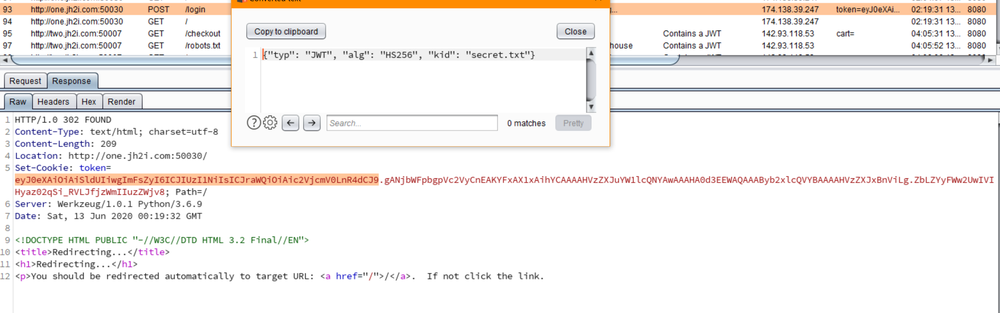
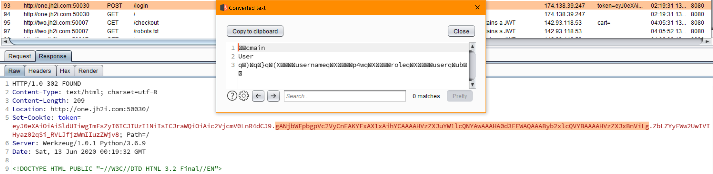
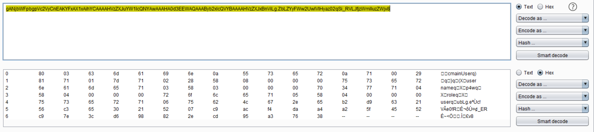

## B'omarr Style, WEB 200 pti
#### Author: p4w

### TL;DR
In this challenge we have to exploit a __kid path traversal__ vulnerability in order to be able to modify and sign our jwt-token and gain RCE via pickle serialization.

### Token analysis
* The application let us create a user and login.
* If the login is successful the application give use a jwt token, let's analyze the __header__ of the token



* As we can see the `alg` field tell us that the __algorithm__ used to __sign__ the cookie is `HS256` (stand for hash-sha256)
* The `kid` parameter, which the purpose should be to identify a specific __key__ in a set of __keys__, seems to point to a file named `secret.txt`
* Analyze of the payload part of the token



* That is tricky since usually the __payload__ part of a token contains a __json__, instead in this case seems it contains some unreadable characters and for sure is not a valid json. Anyway we can still recognize some words inside it, for example the username used to login and the role.

* Let's see which bytes we have in this payload part:



* Seems reasonable to search for python related stuff since the response coming from the server contains the header `Server: Werkzeug/1.0.1 Python/3.6.9`, that tell us which back-end is used.

* If we search for `python serialized data example`, we can found some resource and notice that the _pattern_ of a __serialized python object__ has the same _pattern_ of our jwt-payload, then we can assume that this is the case.

### Exploit

* The general idea is to tamper the `kid` field in order to force the web-application to __verify the signature__ using a file with a __well known contents__, in this way we have the control over the key used by the web-application. If we have the ability to craft the cookie, then we can gain __RCE__ by modify the payload part with our __malicious python object__.

* To do that I build a python script. In <a href=./x.py>this</a> script you can see that I picked up the `/proc/sys/kernel/randomize_va_space` file which should be present on every modern linux systems and his contents (by default) is `2\n`

  ```
  $ cat /proc/sys/kernel/randomize_va_space | xxd
  00000000: 320a                                     2.
  ```

* I exploited the RCE using blind-time-based technique to extract the __flag.txt__ contents, but reading other writeup I notice that I can use a python reverse shell payload to get a shell on the server.

### reference:
* https://github.com/ticarpi/jwt_tool/wiki/Known-Exploits-and-Attacks
* https://tools.ietf.org/id/draft-ietf-jose-json-web-signature-01.html
* https://book.hacktricks.xyz/pentesting-web/hacking-jwt-json-web-tokens
* https://en.wikipedia.org/wiki/JSON_Web_Token
* https://gist.github.com/mgeeky/cbc7017986b2ec3e247aab0b01a9edcd
* https://root4loot.com/post/exploiting_cpickle/
* https://jwt.io/
