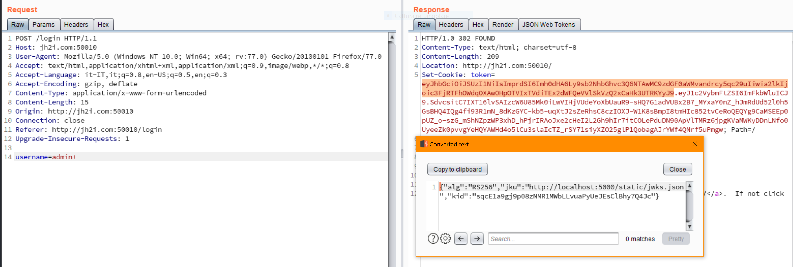
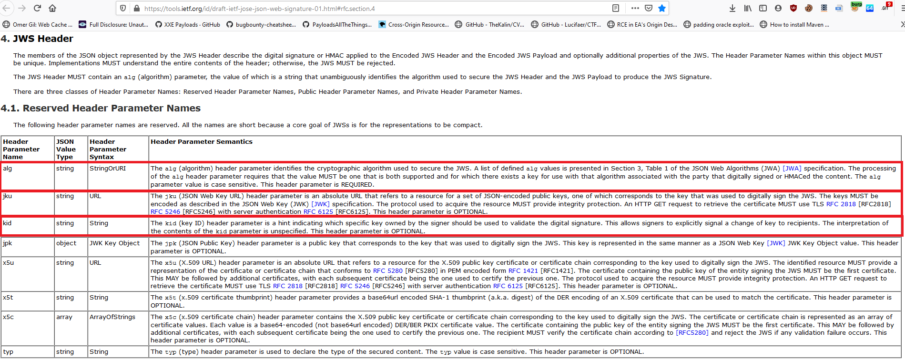
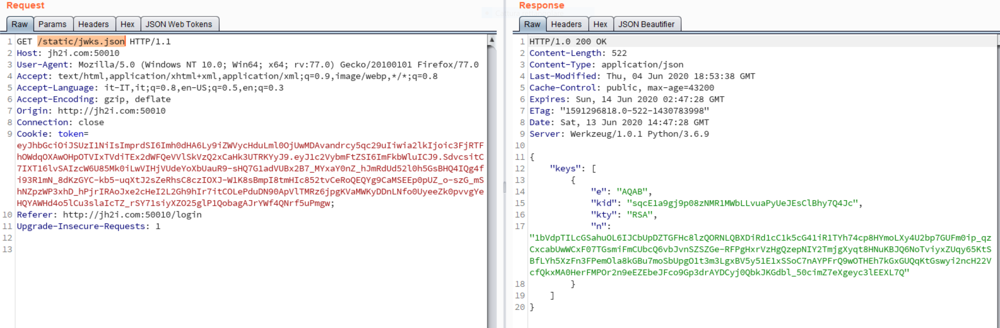
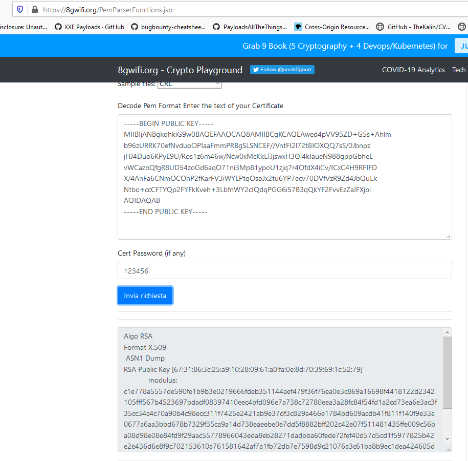
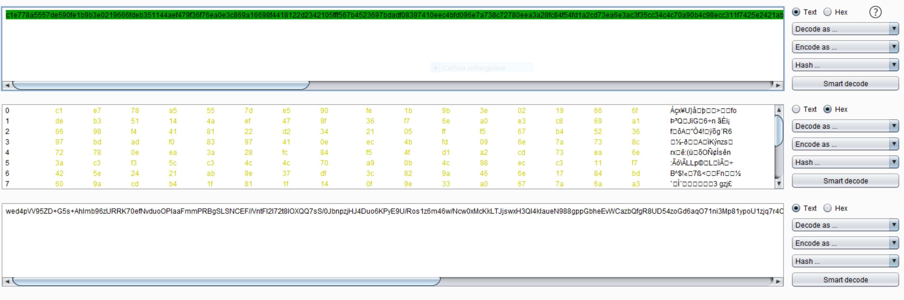
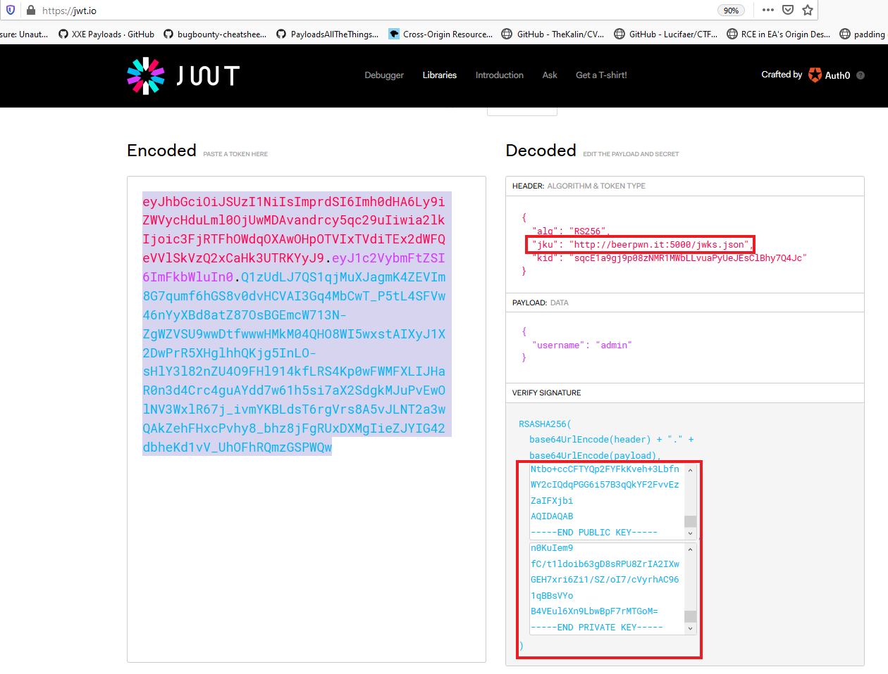
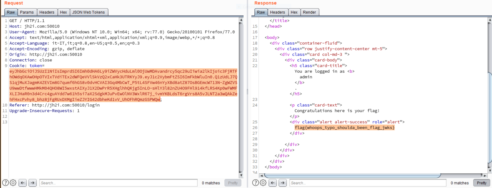

## Flag jokes, WEB 200 pti
#### Author: p4w

### TL;DR
In this challenge we have to exploit a __JWKS Spoofing__ vulnerability. This vulnerability exists if the application __trust an arbitrary url__ to retrieve the __public key__ to verify the cookie signature. An attacker can host his own public key on his malicious server in order to modify and sign the cookie with his key-pair.

### Token analysis

* The challenge let us login with any username we want, except from __admin__, and the goal is to become __admin__.
* The login phase is simple we send the username we want and the application respond with a signed jwt.
* Analysis of the jwt-cookie:



* Token analysis
  * As we can notice we have 3 elements into the json part of the jwt-header and you can find the details at this link https://tools.ietf.org/id/draft-ietf-jose-json-web-signature-01.html#rfc.section.4

  

* To summarize, the `alg` header parameter specify the algorithm used by the web-application to sign the cookie. The `kid` header parameter is used to identify a specific key in a list of keys. The `jku` header parameter is used to point to an URL which contains a set of __json encoded public keys__.

* Let's see if we can retrieve the remote `jwks.json` file pointed by the token we have


### Exploiting the vuln

* The general idea should be to tamper the `jkw` to point to our server hosting our `jwks.json` file with our lists of keys.

* Generate RSA key-pair with `openssl`:
  * with this command we can generate the RSA private key:
  ```
  $ openssl genpkey -algorithm RSA -out private_key.pem -pkeyopt rsa_keygen_bits:2048
  ```
  * with this command we can extract the public certificate associated to the RSA private key previously created:
  ```
  $ openssl rsa -pubout -in private_key.pem -out public_key.pem
  ```
* Now we should have both __PUBLIC__ and __PRIVATE__ certificate in our current folder and we need to extract the `n` value. To do that I used an online service:



* Since the values for the public key contained in the `jwks.json` shold be in base64, then we need to convert the n from `hex` to `base64(raw-hex-bytes)`. To do that we can use burp-proxy:



* Create our `jwks.json` file. To do that we can just use the original one and replace the value of __n__ with the value associated with our RSA-key:

  ```
  $ cat jwks.json
  {
      "keys": [
          {
              "e": "AQAB",
              "kid": "sqcE1a9gj9p08zNMR1MWbLLvuaPyUeJEsClBhy7Q4Jc",
              "kty": "RSA",
              "n": "wed4pVV95ZD+G5s+Ahlmb96zURRK70efNvduoOPIaaFmmPRBgSLSNCEF//VntFI2l72t8IOXQQ7sS/0JbnpzjHJ4Duo6KPyE9U/Ros1z6m46w/Ncw0xMcKkLTJjswxH3Ql4kIaueN988gppGbheEvWCazbQfgR8UD54zoGd6aqO71ni3Mp81ypoU1zjq7r4OfdX4iCv/ICxC4H9RFIFDX/4AnFa6CNmOCOhP2fKarFV3iWYEPtqOsoJx2tu6YP7ecv70DVfVzR9Zd4JbQuLkNtbo+ccCFTYQp2FYFkKveh+3LbfnWY2cIQdqPGG6i57B3qQkYF2FvvEzZaIFXjbiAQ=="
          }
      ]
  }
  ```
* Now we need to modify the __jku__ value of the jwt-header to point to our server where we hosted the `jwks.json` file, and modify the payload data to become `admin`. After we can sign the cookie with our hosted RSA key-pair and to do that I used the https://jwt.io service:



* Send the request to the challenge web application and get the __flag__



### reference:
* https://github.com/ticarpi/jwt_tool/wiki/Known-Exploits-and-Attacks
* https://tools.ietf.org/id/draft-ietf-jose-json-web-signature-01.html#rfc.section.4
* https://book.hacktricks.xyz/pentesting-web/hacking-jwt-json-web-tokens
* https://jwt.io/
