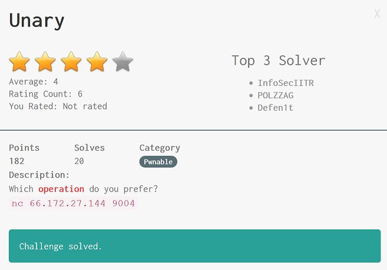

### Author: p4w
### Twitter: @p4w16

Running the binary:
```
$ ./unary
0. EXIT
1. x++
2. x--
3. ~x
4. -x
Operator: 1
x = 5
f(x) = 6
0. EXIT
1. x++
2. x--
3. ~x
4. -x
Operator:
```

Disassemble of main():
```
0x0040080f      call    show_menu  ; sym.show_menu
0x00400814      mov     rdi, rbp
0x00400817      call    read_int   ; sym.read_int
0x0040081c      mov     ebx, eax
0x0040081e      test    eax, eax
0x00400820      je      0x400855
0x00400822      mov     rdi, r14
0x00400825      call    read_int   ; sym.read_int
0x0040082a      sub     ebx, 1
0x0040082d      movsxd  rbx, ebx
0x00400830      mov     rsi, r13
0x00400833      mov     edi, eax
0x00400835      call    qword [r12 + rbx*8]
```
Disassemble of read_int():
```
0x0040079e      sub     rsp, 0x18
0x004007a2      mov     rdx, rdi   ; arg1
0x004007a5      lea     rsi, [0x00400916]
0x004007ac      mov     edi, 1
0x004007b1      mov     eax, 0
0x004007b6      call    __printf_chk ; sym.imp.__printf_chk
0x004007bb      lea     rsi, [var_ch]
0x004007c0      lea     rdi, [0x00400919] ; const char *format
0x004007c7      mov     eax, 0
0x004007cc      call    __isoc99_scanf ; sym.imp.__isoc99_scanf ; int scanf(const char *format)
0x004007d1      cmp     eax, 1     ; rdx
0x004007d4      je      0x4007e0
0x004007d6      mov     edi, 0     ; int status
0x004007db      call    exit       ; sym.imp.exit ; void exit(int status)
0x004007e0      mov     eax, dword [var_ch]
0x004007e4      add     rsp, 0x18
0x004007e8      ret
```

The first call to `read_int()` read our input using `__isoc99_scanf()` and the rexult got stored in `eax` (0x004007e0), after that the contents of `eax` got transferred into `ebx` (0x0040081c).
The vulnerable line reside in 0x00400835 of main() func, as we can see it does a `call qword [r12 + rbx*8]` and we can control the rbx register with our input (our input is used as an offsett to a function pointer).
The sencond input we can pass to the program, will be the argument to the func. pointe look at instruction addr. 0x00400833.<br>
How we can abuse this behavior?<br>
Passing an offsett (our first input) and trick the programm to make a call instruction on __puts@GOT__ to leak libc address, then use same method to call ____isoc99_scanf@GOT__ with a `"%s"` argument to gain stack buffer overflow. From there we can just use __ROP__ to gain a shell.<br>
The exploit is available <a href='./x.py'>here</a>
