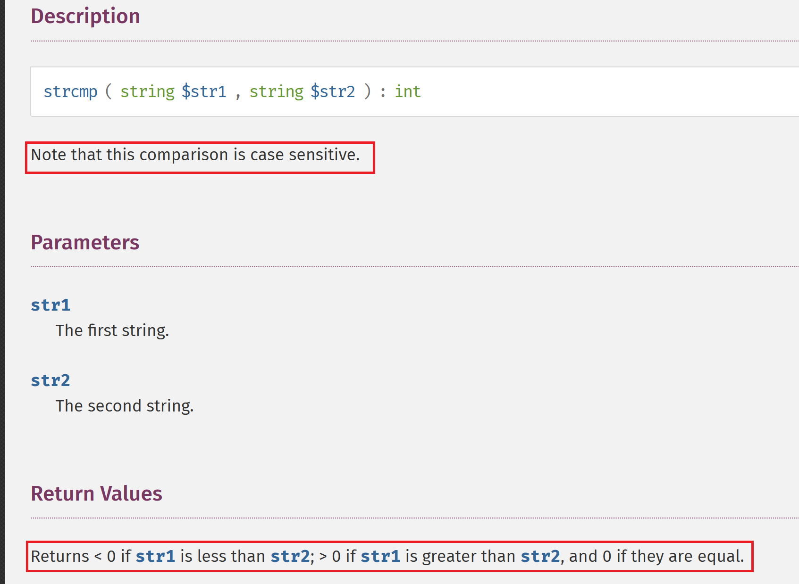
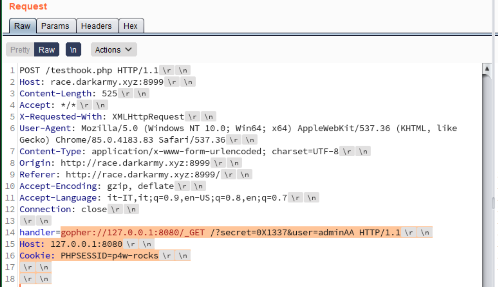
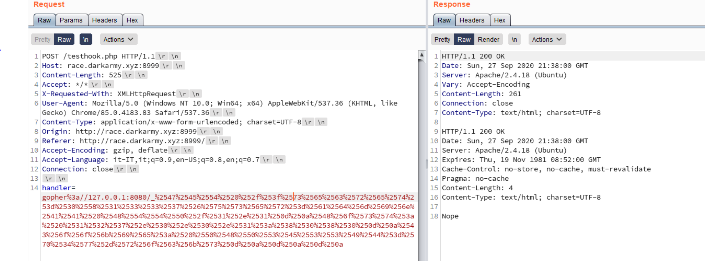

## Chain Race - Web challenge
## Author: p4w@beerpwn
#### Twitter: https://twitter.com/p4w16

## TL;DR
This challenge is about exploiting an __SSRF__ vulnerability to connect to an internal service which is vulnerable to a __race condition__.

## Challenge description


## Solution
By opening the link given we come across a simple web-page that accept a user input. It expect an __URL__ as parameter and it will make a request to the given URL, then the results will be printed back to the page.


This smell like __SSRF__ vulnerability, indeed if we try to input this simple payload http://127.0.0.1/, we can fetch the index page.
By using a proxy we can see that the requests will be sent to a PHP script `testhook.php`.


So the technology should be PHP, and we have an SSRF. Next step is to try if we can actually use other protocols such as `file://`, `gopher://`...\
Let's start with `file://`, since will be useful if we can leak some files from the server.
Following the challenge description, I started with the source code:


So that confirm that the application use php-curl to fetch our input, also there isn't any check on our input.\
Next file that I extracted was the `passwd` since we can potentially find some useful information about users on the system.


As we can see it seems that there is an account `localhost8080` that seems related to another __hidden-service__. Here I just trusted, that the port of the service could be __8080__ since is contained in the name.\
So let's try to make an __http__ request to `http://127.0.0.1:8080/`:


Nice, there is another __php web application binded to localhost__. By reading the code associated we can see that it will give us the __flag__ but only if we pass some __checks__.\
Let's highlight the source code where the checks are done:


 So to get the flag we need to pass these checks against this condition `if (($_GET['secret'] == "0x1337")	|| $_GET['user'] == "admin") {   die("nope"); }`:
 * `strcmp($_GET['user'],"admin") ? 1 : 0;`
 * `strcasecmp($_GET['secret'], "0x1337") == 0`
 * `unlink($temp_name)`

For the first and the second one we can just read the php-docs for the function `strcmp` and `strcasecmp`



Looking at return value of this function, to bypass the check we just need to pass a longer string then `admin` like `adminA`


To bypass this we can just notice that `strcasecmp` is __case insensitive__, then we can use `0X1337` to bypass this one.


The last one is the most tricky. In order to get the flag, it's necessary that the `unlink()` will fail. One reason for unlink to fail is to unlink a non existent file. We can test this behavior with php-cli:


Let's analyze how the filename is created, this is the line of code responsible for that:\
```$temp_name = sha1(md5(date("ms").$_COOKIE['PHPSESSID']));```
The first thing to notice is that the __randomness__ of `$temp_name` is given by 2 thing, the first the `date()` function and the second one from the `PHPSESSID`.
By testing the date function we can notice that the precision is the second.


So that, if we make two distinct requests in a short period of time we will eventually get the same value from the `date("ms")` function. So theoretically this can be solved by using two process that will make the request separately.\
The last problem to solve is the `PHPSESSID` value. If we make a request with the `http` protocol, we can't control the `PHPSESSID` cookie value that will be generated by the `session_start`, but we have `gopher://` wrapper and with that we can craft an entire http request containing our chosen `PHPSESSID`!
Let's test this part.\
Testing locally with some debug, notice the PHPSESSID value

Testing __gopher__ on remote server



Nice, all seems to work. Now, to explain why the race condition can eventually solve the challenge and retrieve the flag, I've done this image that should explain how the race condition work.


## Flag time

Let's go with race condition, for that I used burp intruder


Cheers p4w!
